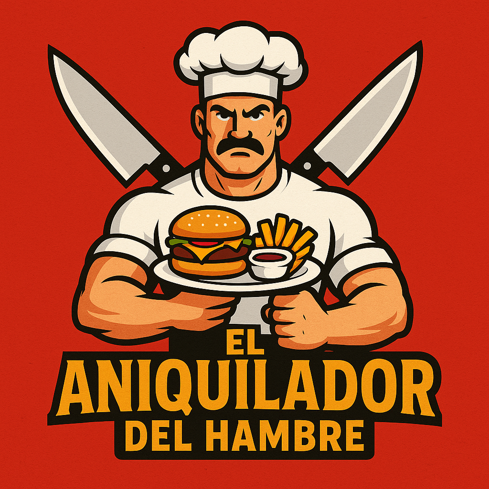

# El Aniquilador del Hambre

Este proyecto es un sitio web diseñado para un restaurante ficticio llamado "El Aniquilador del Hambre". El sitio incluye información sobre el menú, la historia del restaurante, sus sucursales y un formulario de contacto.

## Características

- **Header atractivo**: El nombre del restaurante está alineado a la izquierda, mientras que los enlaces de navegación están alineados a la derecha.
- **Carrusel de comidas**: Presenta diferentes categorías de alimentos, incluyendo sándwiches, platos, bebestibles y postres.
- **Sección de historia**: Muestra los inicios, el crecimiento y testimonios de clientes.
- **Sucursales**: Información detallada de las ubicaciones del restaurante con mapas integrados.
- **Formulario de contacto**: Permite a los usuarios enviar consultas o reclamos.

## Estructura del Proyecto

```
├── index.html
├── css/
│   └── styles.css
├── imágenes/
│   ├── sandwich1.png
│   ├── sandwich2.png
│   ├── sandwich3.png
│   ├── plato1.png
│   ├── plato2.png
│   ├── plato3.png
│   ├── bebestible1.png
│   ├── bebestible2.png
│   ├── bebestible3.png
│   ├── postre1.png
│   ├── postre2.png
│   ├── postre3.png
│   ├── sucursal1.jpg
│   ├── sucursal2.jpg
│   ├── sucursal3.jpg
│   ├── logo.png
│   ├── crecimiento.png
│   └── testimonios.png
└── Link a github.txt
```

## Tecnologías Utilizadas

- **HTML5**: Estructura del sitio web.
- **CSS3**: Estilos personalizados para el diseño.
- **Bootstrap 5**: Componentes y diseño responsivo.

## Cómo Usar

1. Clona este repositorio:
   ```bash
   git clone <URL_DEL_REPOSITORIO>
   ```
2. Abre el archivo `index.html` en tu navegador.

## Capturas de Pantalla

### Logo



## Autor

- **Maximiliano Rochow**

## Licencia

Este proyecto está bajo la Licencia MIT. Puedes ver más detalles en el archivo LICENSE si está disponible.
